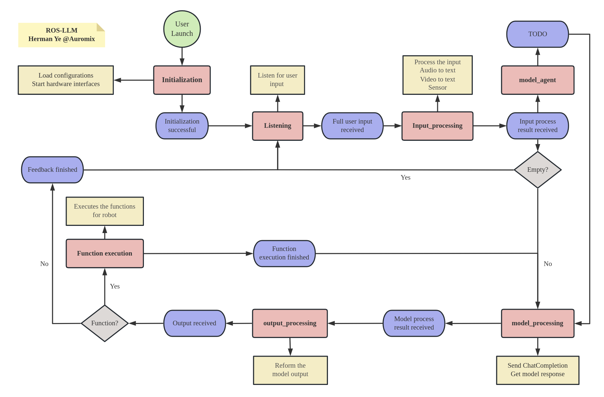

[](https://github.com/Auromix) &nbsp;
[](http://docs.ros.org/en/humble/index.html) &nbsp;
[](https://ubuntu.com/) &nbsp; [](https://github.com/Auromix/ROS-LLM/blob/ros2-humble/LICENSE) &nbsp;
[](https://github.com/Auromix/ROS-LLM/stargazers) &nbsp;
[](https://twitter.com/Hermanye233) &nbsp;
# ROS-LLM
The ROS-LLM project is a ROS framework for embodied intelligence applications. It enables natural language interactions and large model-based control of robot motion and navigation for any robot operating on ROS.

ROS-LLM empowers you to utilize functionalities based on Large Language Models, such as GPT-4 and ChatGPT, for robot decision-making and control. 

This framework is designed to be easy to extend. By simply providing a function interface for your robot, following the provided example, you can integrate and use ROS-LLM within ten minutes. 

ROS-LLM offers a simple solution for quickly creating interactive and control experiences with any robot.


## 🚀 Features

- 🤖 **ROS Integration**: Smoothly interacts with the Robot Operating System (ROS) for expansive robotic control. 

- 🧠 **Large Language Models Support**: Leverages GPT-4 and ChatGPT for enhanced decision-making and task management.

- 🗣️ **Natural Interaction**: Facilitates intuitive communication with robots through conversational engagement.

- 🔄 **Flexible Control**: Utilizes LLM-based systems for tasks such as motion and navigation based on language model interpretation.

- 🔌 **Simplified Extensibility**: Provides an easy interface for seamless robot function integration. 

- 🛠️ **Quick Development**: Creates interactive robot control experiences swiftly, sometimes in under ten minutes.

- 📚 **Instructional Examples**: Offers comprehensive tutorials and examples for easier understanding and implementation.

- 🗃️ **History Storage**: Retains local chat histories for convenient review and reference.


## 🔥 Quickstart Guide

Follow the instructions below to set up ROS-LLM:

**1. Clone the Repository:**

Use the command below to clone the repository.
```bash
git clone https://github.com/Auromix/ROS-LLM.git
```

**2. Install Dependencies:**

Navigate to the `llm_install` directory and execute the installation script.
```bash
cd ROS-LLM/llm_install
bash dependencies_install.sh
```

**3. Configure OpenAI Settings:**

If you don't have an OpenAI API key, you can obtain one from [OpenAI Platform](https://platform.openai.com). Use the script below to configure your OpenAI API key.
```bash
cd ROS-LLM/llm_install
bash config_openai_api_key.sh
```

**4. Configure AWS Settings (Optional):**

For cloud natural interaction capabilities, configure the AWS settings. If you prefer to use local ASR, this step can be skipped.

For low-performance edge embedded platforms, it is recommended to use ASR cloud services to reduce computing pressure, and for high-performance personal hosts, it is recommended to use local ASR services to speed up response

```bash
cd ROS-LLM/llm_install
bash config_aws.sh
```

**4. Configure OpenAI Whisper Settings (Optional):**

For local natural interaction capabilities, configure the OpenAI Whisper settings. If you prefer to use cloud ASR, this step can be skipped.

For low-performance edge embedded platforms, it is recommended to use ASR cloud services to reduce computing pressure, and for high-performance personal hosts, it is recommended to use local ASR services to speed up response
```bash
pip install -U openai-whisper
pip install setuptools-rust
```

**5. Build the Workspace:**

Navigate to your workspace directory and build the workspace.
```bash
cd <your_ws>
rosdep install --from-paths src --ignore-src -r -y  # Install dependencies
colcon build --symlink-install
```

**6. Run the Demo:**

Source the setup script and launch the Turtlesim demo with cloud ASR.
```bash
source <your_ws>/install/setup.bash
ros2 launch llm_bringup chatgpt_with_turtle_robot.launch.py
```
start listening
```bash
ros2 topic pub /llm_state std_msgs/msg/String "data: 'listening'" -1
```

## ⚙️ Configure Your Own Robot (Optional)

To use the framework with your own robot, modify the `llm_robot` and `llm_config` packages to suit your robot's specifications. This allows you to customize the behavior of your robot.


## 🧑‍💻 Future Development Plans

We are continuously striving to enhance ROS-LLM to better serve the developers and roboticists in the community. Below are the key developments we plan to undertake in the upcoming updates:

- [ ] Agent Mechanism

Adding an agent mechanism allows long sequence tasks to be well divided.

- [ ] Feedback Channel from External Functions

We plan to add a feedback mechanism for the robot to receive information from external functions. This would significantly assist model-based decision-making processes.

- [ ] Navigation Interface

A new interface for robot navigation is also in the pipeline. It will enable the utilization of this framework in navigation-oriented tasks.

- [ ] Sensor Input Interface

The addition of other sensor input interfaces is another major development. This will incorporate environmental perception into model decision premises, preparing for functionalities such as obstacle avoidance.

- [ ] Integration with Vision-based Models like Palm-e

We aim to extend the capabilities of ROS-LLM by integrating models that allow for visual input, like Palm-e. This would enable the use of advanced computer vision technologies for better environment interaction.

- [ ] Continuous Optimization

Last but not least, we will focus on continuous optimization of the framework. We are committed to improving the rationality and extensibility of ROS-LLM to make it easier for developers to customize and extend the framework according to their needs.

Keep an eye on this repo for updates. Your suggestions and contributions are always welcome!


## 🙋 To user
If you find this project useful, please consider giving it a ⭐️ star on GitHub! Your support helps us improve the project and encourages further development. Don't forget to also share it with your friends and colleagues who might it beneficial. Thank you for your support! 

## 🏆 Contributing
Contributions are welcome! Please read the [contributing guidelines](CONTRIBUTING.md) before submitting a pull request.


## 🪪 License
```
Copyright 2023 Herman Ye @Auromix
Licensed under the Apache License, Version 2.0 (the "License");
you may not use this file except in compliance with the License.
You may obtain a copy of the License at
    http://www.apache.org/licenses/LICENSE-2.0
Unless required by applicable law or agreed to in writing, software
distributed under the License is distributed on an "AS IS" BASIS,
WITHOUT WARRANTIES OR CONDITIONS OF ANY KIND, either express or implied.
See the License for the specific language governing permissions and
limitations under the License. 
```
